# Ptychodus-Agentic-Workflow
Agentic workflow started from Argonne Hackathon (05-13-2026)




This code requires OPENAI_API creds to function. Update this in a `.env` file.

```bash
OPENAI_API_BASE_URL=https://inference-api.alcf.anl.gov/resource_server/sophia/vllm/v1
OPENAI_API_MODEL=llama3.1
OPENAI_API_KEY=BogusKEYBogusKeyBogusKEYBogusKeyBogusKEYBogusKeyBogusKEYBogusKey
```
